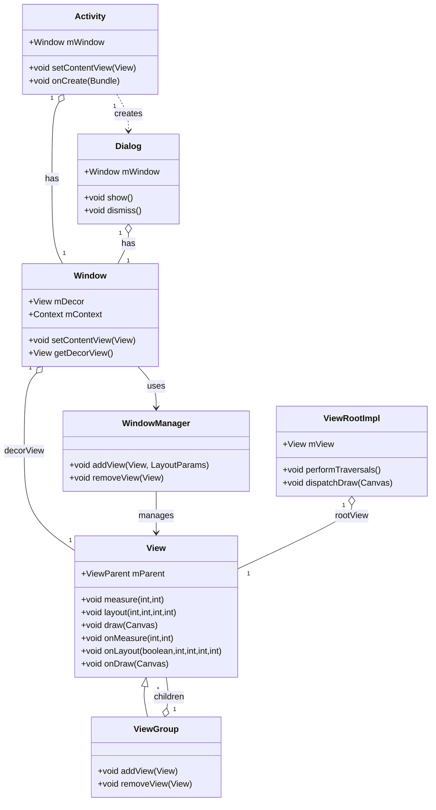
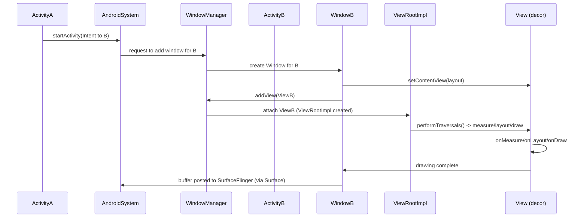
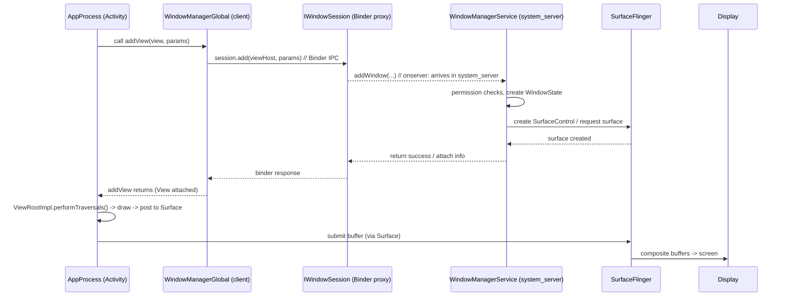

```mermaid
sequenceDiagram
  autonumber
  participant Choreographer as Choreographer (UI thread)
  participant VRI as ViewRootImpl.performTraversals() (UI thread)
  participant HWRenderer as ThreadedRenderer / HardwareRenderer (UI thread proxy)
  participant RenderProxy as RenderProxy (JNI/native proxy) (UI thread)
  participant JNI as android_graphics_HardwareRenderer.cpp (JNI)
  participant RT as RenderThread (native thread in app process)
  participant HWui as hwui / RenderNode / Skia (native C++ on RT)
  participant Surface as Surface / BufferQueue
  participant SF as SurfaceFlinger (system process)

  Choreographer->>VRI: frame callback -> performTraversals()
  VRI->>HWRenderer: request draw / record display list
  HWRenderer->>RenderProxy: submit display list / syncAndDrawFrame()
  RenderProxy->>JNI: JNI call -> enqueue work to RenderThread
  JNI->>RT: schedule frame replay (RenderThread)
  RT->>HWui: replay display-list -> hwui calls Skia GPU code (GrContext/Skia)
  HWui->>Surface: render into GPU-backed buffer / EGL surface
  Surface->>SF: buffer queued -> SurfaceFlinger composites -> display
  ```

  ```mermaid
  sequenceDiagram
  autonumber
  participant HW as Display Hardware (native)
  participant SF as SurfaceFlinger (native)
  participant Kernel as Kernel (native)
  participant AppMQ as MessageQueue (native poll)
  participant Looper as Looper.loop() (Java)
  participant Choreo as Choreographer (Java)
  participant VRI as ViewRootImpl.performTraversals() (Java)
  participant Renderer as ThreadedRenderer / Canvas (Java/native)
  participant RenderThread as RenderThread / hwui (native)
  participant Surface as Surface/BufferQueue (app native)
  participant SFcomp as SurfaceFlinger (native)

  HW->>SF: vsync interrupt
  SF->>Kernel: deliver event -> eventfd
  Kernel->>AppMQ: wake up poll/epoll (native)
  AppMQ->>Looper: poll returns (native -> Java)
  Looper->>Choreo: dispatch frame (Java)
  Choreo->>VRI: doFrame -> performTraversals() (Java)
  alt hardware path
    VRI->>Renderer: request ThreadedRenderer draw (Java)
    Renderer->>RenderThread: enqueue display-list (JNI -> native)
    RenderThread->>Surface: GPU render to buffer (native)
  else software path
    VRI->>Renderer: invoke Canvas.draw... (Java)
    Renderer->>NativeCanvas: JNI -> Skia CPU raster (native)
    NativeCanvas->>Surface: write raster buffer (native)
  end
  Surface->>SFcomp: post buffer (native)
  SFcomp->>HW: composer -> display
  ```